# Dialogue graphs

Generated by `tools/content_graphs.py` — do not edit by hand.

## act1.json

### theo

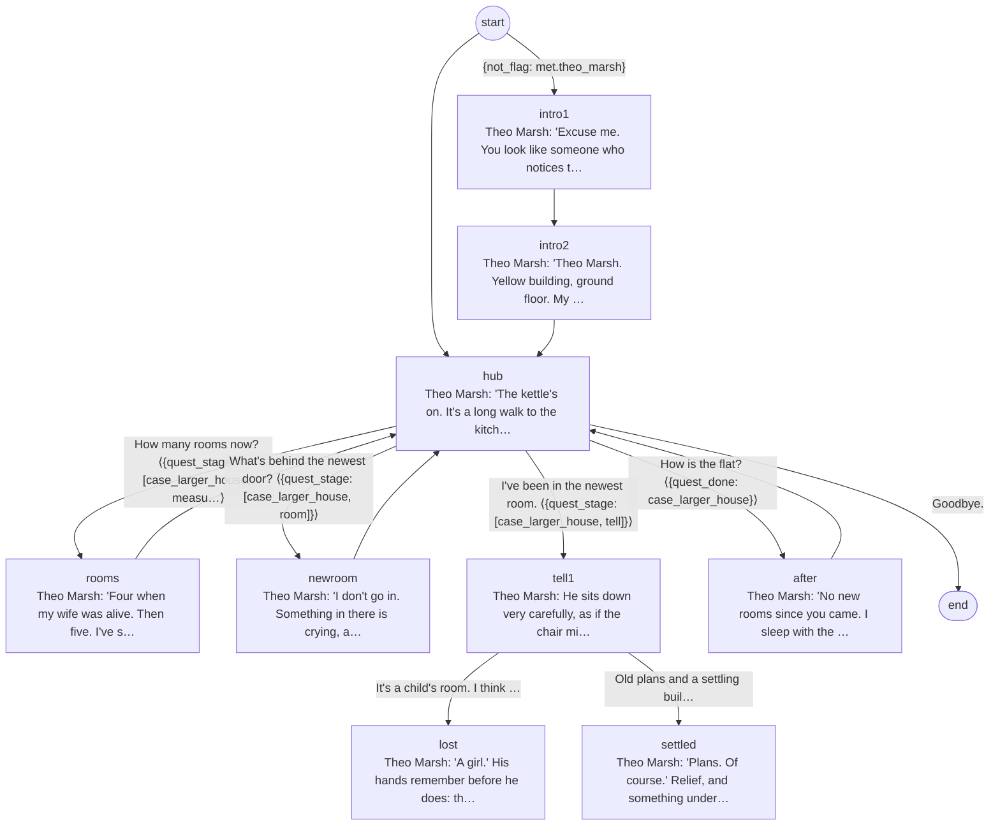
```mermaid
flowchart TD
  theo_START(("start"))
  theo_START --> theo_hub
  theo_START -->|"{not_flag: met.theo_marsh}"| theo_intro1
  theo_intro1["intro1<br/>Theo Marsh: 'Excuse me. You look like someone who notices t…"]
  theo_intro1 --> theo_intro2
  theo_intro2["intro2<br/>Theo Marsh: 'Theo Marsh. Yellow building, ground floor. My …"]
  theo_intro2 --> theo_hub
  theo_hub["hub<br/>Theo Marsh: 'The kettle's on. It's a long walk to the kitch…"]
  theo_hub -->|"How many rooms now? ⟨{quest_stage: [case_larger_house, measu…⟩"| theo_rooms
  theo_hub -->|"What's behind the newest door? ⟨{quest_stage: [case_larger_house, room]}⟩"| theo_newroom
  theo_hub -->|"I've been in the newest room. ⟨{quest_stage: [case_larger_house, tell]}⟩"| theo_tell1
  theo_hub -->|"How is the flat? ⟨{quest_done: case_larger_house}⟩"| theo_after
  theo_hub_end_4(["end"])
  theo_hub -->|"Goodbye."| theo_hub_end_4
  theo_rooms["rooms<br/>Theo Marsh: 'Four when my wife was alive. Then five. I've s…"]
  theo_rooms --> theo_hub
  theo_newroom["newroom<br/>Theo Marsh: 'I don't go in. Something in there is crying, a…"]
  theo_newroom --> theo_hub
  theo_tell1["tell1<br/>Theo Marsh: He sits down very carefully, as if the chair mi…"]
  theo_tell1 -->|"It's a child's room. I think …"| theo_lost
  theo_tell1 -->|"Old plans and a settling buil…"| theo_settled
  theo_lost["lost<br/>Theo Marsh: 'A girl.' His hands remember before he does: th…"]
  theo_settled["settled<br/>Theo Marsh: 'Plans. Of course.' Relief, and something under…"]
  theo_after["after<br/>Theo Marsh: 'No new rooms since you came. I sleep with the …"]
  theo_after --> theo_hub
```

### theo_corridor

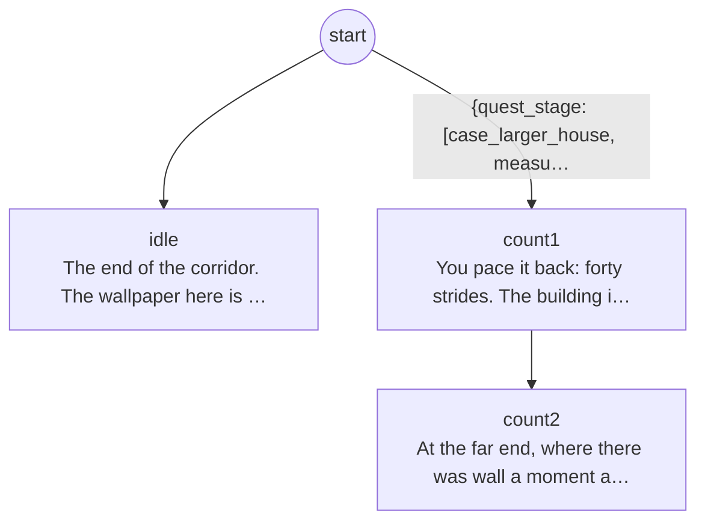
```mermaid
flowchart TD
  theo_corridor_START(("start"))
  theo_corridor_START --> theo_corridor_idle
  theo_corridor_START -->|"{quest_stage: [case_larger_house, measu…"| theo_corridor_count1
  theo_corridor_idle["idle<br/>The end of the corridor. The wallpaper here is …"]
  theo_corridor_count1["count1<br/>You pace it back: forty strides. The building i…"]
  theo_corridor_count1 --> theo_corridor_count2
  theo_corridor_count2["count2<br/>At the far end, where there was wall a moment a…"]
```

### new_room_enter

```mermaid
flowchart TD
  new_room_enter_START(("start"))
  new_room_enter_START --> new_room_enter_1
  new_room_enter_1["1<br/>A child's bedroom, warm, lamp lit. It has been …"]
```

### new_room_bed

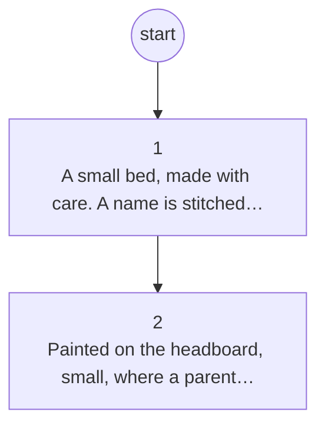
```mermaid
flowchart TD
  new_room_bed_START(("start"))
  new_room_bed_START --> new_room_bed_1
  new_room_bed_1["1<br/>A small bed, made with care. A name is stitched…"]
  new_room_bed_1 --> new_room_bed_2
  new_room_bed_2["2<br/>Painted on the headboard, small, where a parent…"]
```

### new_room_desk

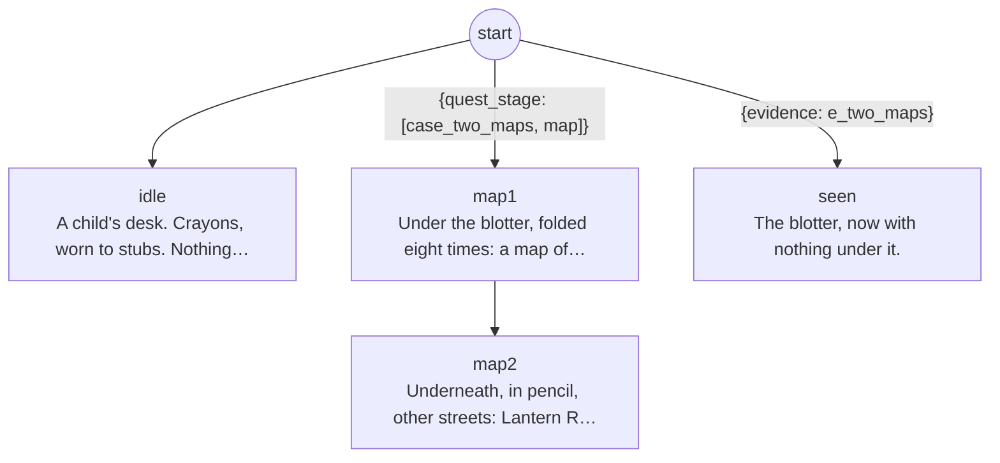
```mermaid
flowchart TD
  new_room_desk_START(("start"))
  new_room_desk_START --> new_room_desk_idle
  new_room_desk_START -->|"{quest_stage: [case_two_maps, map]}"| new_room_desk_map1
  new_room_desk_START -->|"{evidence: e_two_maps}"| new_room_desk_seen
  new_room_desk_idle["idle<br/>A child's desk. Crayons, worn to stubs. Nothing…"]
  new_room_desk_map1["map1<br/>Under the blotter, folded eight times: a map of…"]
  new_room_desk_map1 --> new_room_desk_map2
  new_room_desk_map2["map2<br/>Underneath, in pencil, other streets: Lantern R…"]
  new_room_desk_seen["seen<br/>The blotter, now with nothing under it."]
```

### storeroom_enter

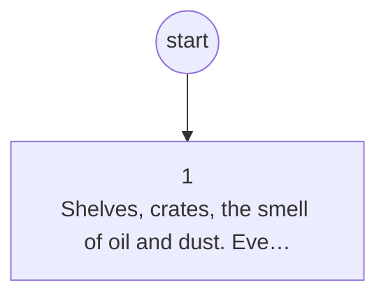
```mermaid
flowchart TD
  storeroom_enter_START(("start"))
  storeroom_enter_START --> storeroom_enter_1
  storeroom_enter_1["1<br/>Shelves, crates, the smell of oil and dust. Eve…"]
```

### storeroom_crate

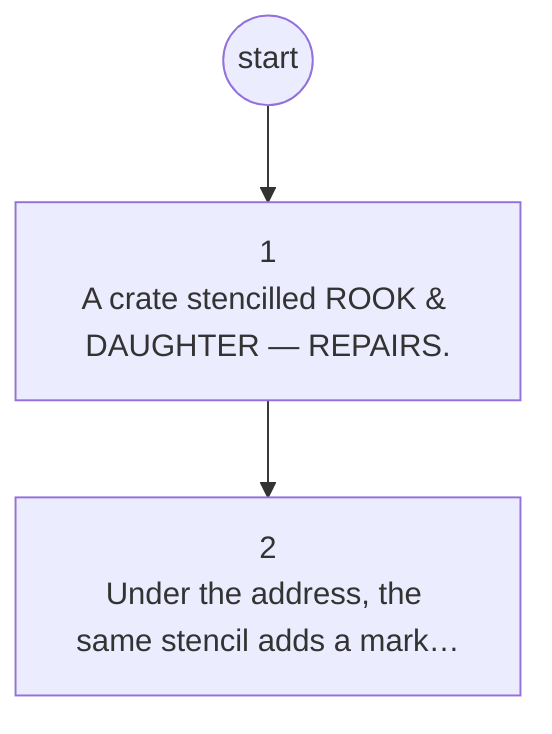
```mermaid
flowchart TD
  storeroom_crate_START(("start"))
  storeroom_crate_START --> storeroom_crate_1
  storeroom_crate_1["1<br/>A crate stencilled ROOK & DAUGHTER — REPAIRS."]
  storeroom_crate_1 --> storeroom_crate_2
  storeroom_crate_2["2<br/>Under the address, the same stencil adds a mark…"]
```

### storeroom_ledger

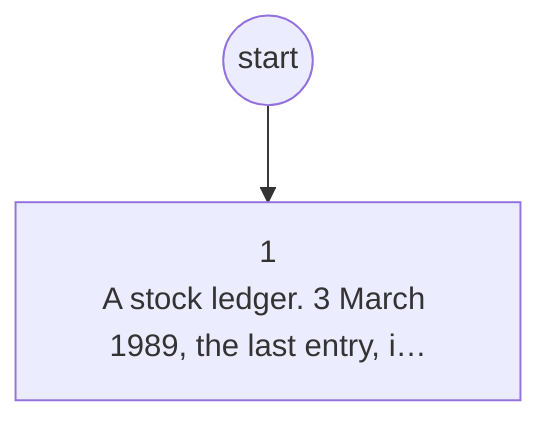
```mermaid
flowchart TD
  storeroom_ledger_START(("start"))
  storeroom_ledger_START --> storeroom_ledger_1
  storeroom_ledger_1["1<br/>A stock ledger. 3 March 1989, the last entry, i…"]
```

## act2.json

### ward_enter

```mermaid
flowchart TD
  ward_enter_START(("start"))
  ward_enter_START --> ward_enter_alone1
  ward_enter_START -->|"{flag: ward.ivo_invite}"| ward_enter_ivo1
  ward_enter_START -->|"{flag: ward.nadiya_invite}"| ward_enter_nad1
  ward_enter_ivo1["ivo1<br/>Ivo is waiting at the harbour stop, collar up. …"]
  ward_enter_ivo1 --> ward_enter_ivo2
  ward_enter_ivo2["ivo2<br/>Ivo Calder: 'Don't promise anybody anything in here. They'l…"]
  ward_enter_ivo2 --> ward_enter_common
  ward_enter_nad1["nad1<br/>Nadiya knocks three times on the timetable. It …"]
  ward_enter_nad1 --> ward_enter_nad2
  ward_enter_nad2["nad2<br/>Nadiya Sol: 'Welcome to the Ward. Everyone here was somebod…"]
  ward_enter_nad2 --> ward_enter_common
  ward_enter_alone1["alone1<br/>The pasted strip on the timetable is warm. You …"]
  ward_enter_alone1 --> ward_enter_common
  ward_enter_common["common<br/>A street that was removed in 1962 is still here…"]
```

### depot_enter

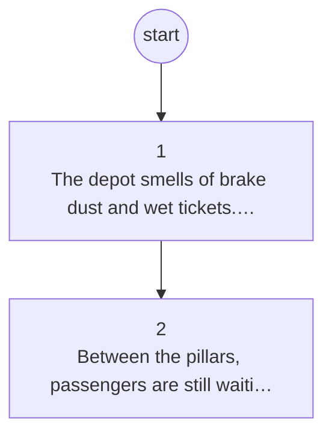
```mermaid
flowchart TD
  depot_enter_START(("start"))
  depot_enter_START --> depot_enter_1
  depot_enter_1["1<br/>The depot smells of brake dust and wet tickets.…"]
  depot_enter_1 --> depot_enter_2
  depot_enter_2["2<br/>Between the pillars, passengers are still waiti…"]
```

### platform_conductor

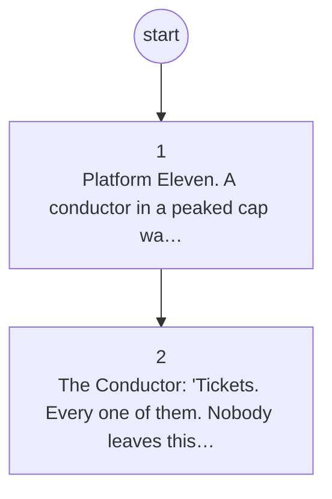
```mermaid
flowchart TD
  platform_conductor_START(("start"))
  platform_conductor_START --> platform_conductor_1
  platform_conductor_1["1<br/>Platform Eleven. A conductor in a peaked cap wa…"]
  platform_conductor_1 --> platform_conductor_2
  platform_conductor_2["2<br/>The Conductor: 'Tickets. Every one of them. Nobody leaves this…"]
```

### alderman

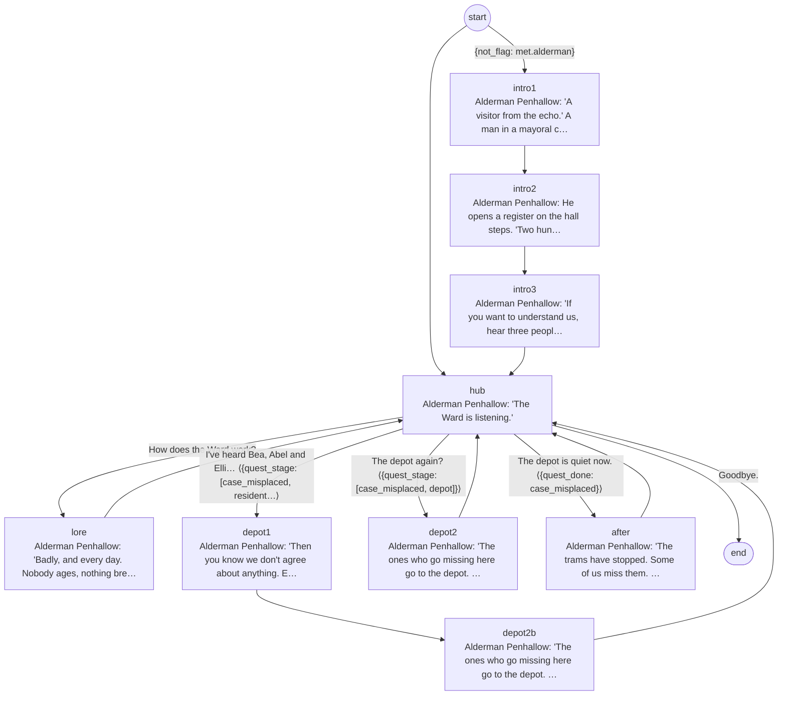
```mermaid
flowchart TD
  alderman_START(("start"))
  alderman_START --> alderman_hub
  alderman_START -->|"{not_flag: met.alderman}"| alderman_intro1
  alderman_intro1["intro1<br/>Alderman Penhallow: 'A visitor from the echo.' A man in a mayoral c…"]
  alderman_intro1 --> alderman_intro2
  alderman_intro2["intro2<br/>Alderman Penhallow: He opens a register on the hall steps. 'Two hun…"]
  alderman_intro2 --> alderman_intro3
  alderman_intro3["intro3<br/>Alderman Penhallow: 'If you want to understand us, hear three peopl…"]
  alderman_intro3 --> alderman_hub
  alderman_hub["hub<br/>Alderman Penhallow: 'The Ward is listening.'"]
  alderman_hub -->|"How does the Ward work?"| alderman_lore
  alderman_hub -->|"I've heard Bea, Abel and Elli… ⟨{quest_stage: [case_misplaced, resident…⟩"| alderman_depot1
  alderman_hub -->|"The depot again? ⟨{quest_stage: [case_misplaced, depot]}⟩"| alderman_depot2
  alderman_hub -->|"The depot is quiet now. ⟨{quest_done: case_misplaced}⟩"| alderman_after
  alderman_hub_end_4(["end"])
  alderman_hub -->|"Goodbye."| alderman_hub_end_4
  alderman_lore["lore<br/>Alderman Penhallow: 'Badly, and every day. Nobody ages, nothing bre…"]
  alderman_lore --> alderman_hub
  alderman_depot1["depot1<br/>Alderman Penhallow: 'Then you know we don't agree about anything. E…"]
  alderman_depot1 --> alderman_depot2b
  alderman_depot2b["depot2b<br/>Alderman Penhallow: 'The ones who go missing here go to the depot. …"]
  alderman_depot2b --> alderman_hub
  alderman_depot2["depot2<br/>Alderman Penhallow: 'The ones who go missing here go to the depot. …"]
  alderman_depot2 --> alderman_hub
  alderman_after["after<br/>Alderman Penhallow: 'The trams have stopped. Some of us miss them. …"]
  alderman_after --> alderman_hub
```

### bea

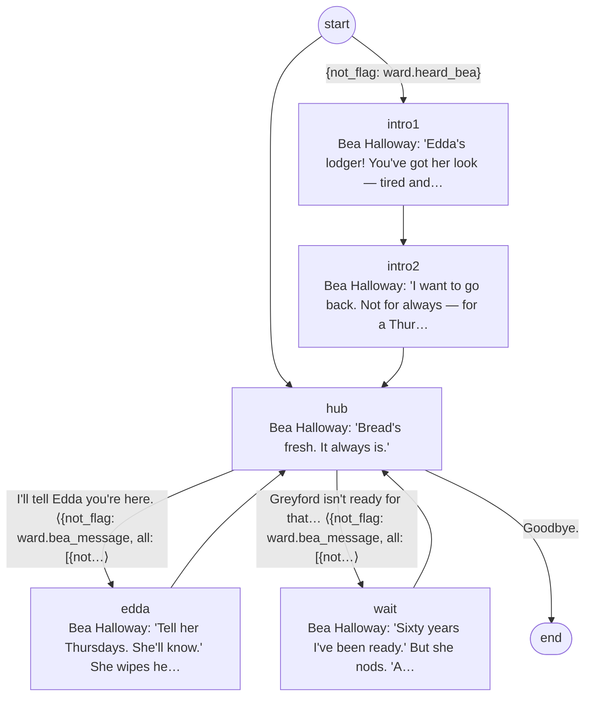
```mermaid
flowchart TD
  bea_START(("start"))
  bea_START --> bea_hub
  bea_START -->|"{not_flag: ward.heard_bea}"| bea_intro1
  bea_intro1["intro1<br/>Bea Halloway: 'Edda's lodger! You've got her look — tired and…"]
  bea_intro1 --> bea_intro2
  bea_intro2["intro2<br/>Bea Halloway: 'I want to go back. Not for always — for a Thur…"]
  bea_intro2 --> bea_hub
  bea_hub["hub<br/>Bea Halloway: 'Bread's fresh. It always is.'"]
  bea_hub -->|"I'll tell Edda you're here. ⟨{not_flag: ward.bea_message, all: [{not…⟩"| bea_edda
  bea_hub -->|"Greyford isn't ready for that… ⟨{not_flag: ward.bea_message, all: [{not…⟩"| bea_wait
  bea_hub_end_2(["end"])
  bea_hub -->|"Goodbye."| bea_hub_end_2
  bea_edda["edda<br/>Bea Halloway: 'Tell her Thursdays. She'll know.' She wipes he…"]
  bea_edda --> bea_hub
  bea_wait["wait<br/>Bea Halloway: 'Sixty years I've been ready.' But she nods. 'A…"]
  bea_wait --> bea_hub
```

### abel

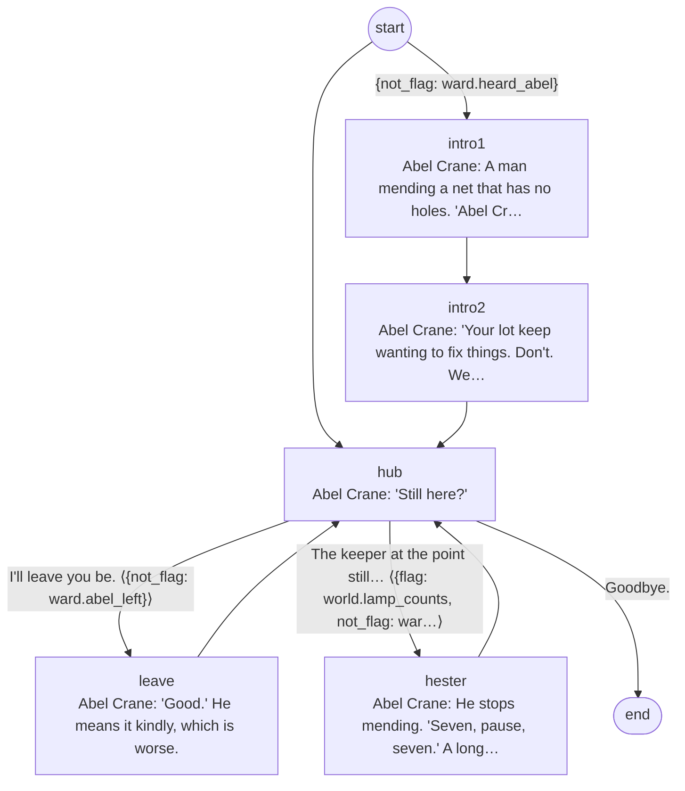
```mermaid
flowchart TD
  abel_START(("start"))
  abel_START --> abel_hub
  abel_START -->|"{not_flag: ward.heard_abel}"| abel_intro1
  abel_intro1["intro1<br/>Abel Crane: A man mending a net that has no holes. 'Abel Cr…"]
  abel_intro1 --> abel_intro2
  abel_intro2["intro2<br/>Abel Crane: 'Your lot keep wanting to fix things. Don't. We…"]
  abel_intro2 --> abel_hub
  abel_hub["hub<br/>Abel Crane: 'Still here?'"]
  abel_hub -->|"I'll leave you be. ⟨{not_flag: ward.abel_left}⟩"| abel_leave
  abel_hub -->|"The keeper at the point still… ⟨{flag: world.lamp_counts, not_flag: war…⟩"| abel_hester
  abel_hub_end_2(["end"])
  abel_hub -->|"Goodbye."| abel_hub_end_2
  abel_leave["leave<br/>Abel Crane: 'Good.' He means it kindly, which is worse."]
  abel_leave --> abel_hub
  abel_hester["hester<br/>Abel Crane: He stops mending. 'Seven, pause, seven.' A long…"]
  abel_hester --> abel_hub
```

### ellie

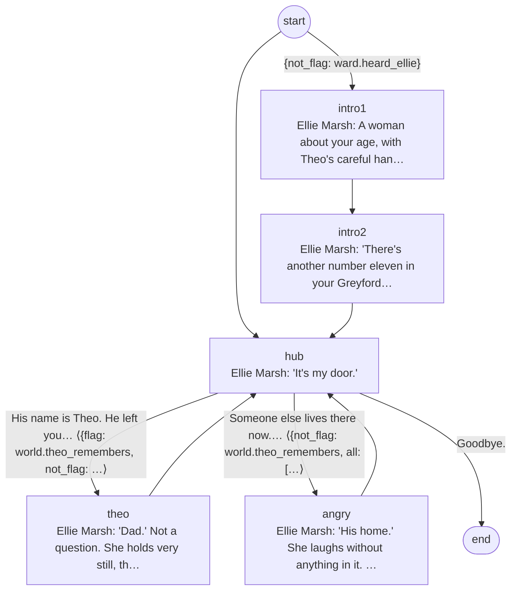
```mermaid
flowchart TD
  ellie_START(("start"))
  ellie_START --> ellie_hub
  ellie_START -->|"{not_flag: ward.heard_ellie}"| ellie_intro1
  ellie_intro1["intro1<br/>Ellie Marsh: A woman about your age, with Theo's careful han…"]
  ellie_intro1 --> ellie_intro2
  ellie_intro2["intro2<br/>Ellie Marsh: 'There's another number eleven in your Greyford…"]
  ellie_intro2 --> ellie_hub
  ellie_hub["hub<br/>Ellie Marsh: 'It's my door.'"]
  ellie_hub -->|"His name is Theo. He left you… ⟨{flag: world.theo_remembers, not_flag: …⟩"| ellie_theo
  ellie_hub -->|"Someone else lives there now.… ⟨{not_flag: world.theo_remembers, all: […⟩"| ellie_angry
  ellie_hub_end_2(["end"])
  ellie_hub -->|"Goodbye."| ellie_hub_end_2
  ellie_theo["theo<br/>Ellie Marsh: 'Dad.' Not a question. She holds very still, th…"]
  ellie_theo --> ellie_hub
  ellie_angry["angry<br/>Ellie Marsh: 'His home.' She laughs without anything in it. …"]
  ellie_angry --> ellie_hub
```

### vale

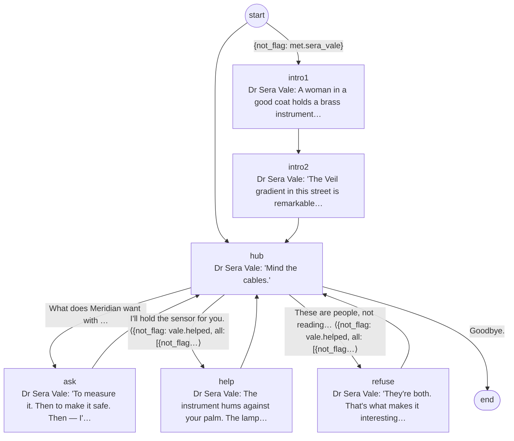
```mermaid
flowchart TD
  vale_START(("start"))
  vale_START --> vale_hub
  vale_START -->|"{not_flag: met.sera_vale}"| vale_intro1
  vale_intro1["intro1<br/>Dr Sera Vale: A woman in a good coat holds a brass instrument…"]
  vale_intro1 --> vale_intro2
  vale_intro2["intro2<br/>Dr Sera Vale: 'The Veil gradient in this street is remarkable…"]
  vale_intro2 --> vale_hub
  vale_hub["hub<br/>Dr Sera Vale: 'Mind the cables.'"]
  vale_hub -->|"What does Meridian want with …"| vale_ask
  vale_hub -->|"I'll hold the sensor for you. ⟨{not_flag: vale.helped, all: [{not_flag…⟩"| vale_help
  vale_hub -->|"These are people, not reading… ⟨{not_flag: vale.helped, all: [{not_flag…⟩"| vale_refuse
  vale_hub_end_3(["end"])
  vale_hub -->|"Goodbye."| vale_hub_end_3
  vale_ask["ask<br/>Dr Sera Vale: 'To measure it. Then to make it safe. Then — I'…"]
  vale_ask --> vale_hub
  vale_help["help<br/>Dr Sera Vale: The instrument hums against your palm. The lamp…"]
  vale_help --> vale_hub
  vale_refuse["refuse<br/>Dr Sera Vale: 'They're both. That's what makes it interesting…"]
  vale_refuse --> vale_hub
```

### rosalind

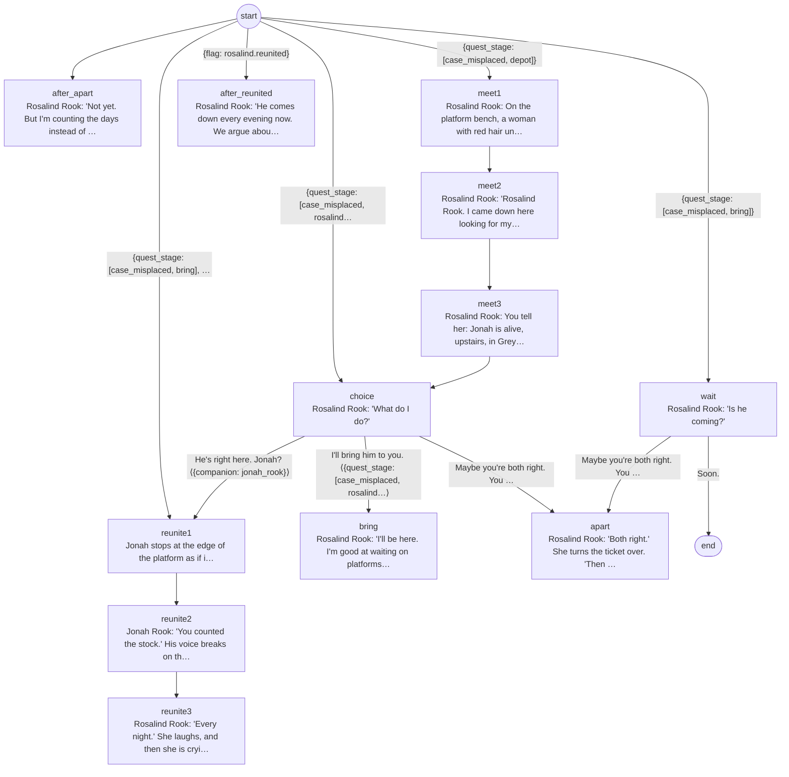
```mermaid
flowchart TD
  rosalind_START(("start"))
  rosalind_START --> rosalind_after_apart
  rosalind_START -->|"{quest_stage: [case_misplaced, depot]}"| rosalind_meet1
  rosalind_START -->|"{quest_stage: [case_misplaced, rosalind…"| rosalind_choice
  rosalind_START -->|"{quest_stage: [case_misplaced, bring], …"| rosalind_reunite1
  rosalind_START -->|"{quest_stage: [case_misplaced, bring]}"| rosalind_wait
  rosalind_START -->|"{flag: rosalind.reunited}"| rosalind_after_reunited
  rosalind_meet1["meet1<br/>Rosalind Rook: On the platform bench, a woman with red hair un…"]
  rosalind_meet1 --> rosalind_meet2
  rosalind_meet2["meet2<br/>Rosalind Rook: 'Rosalind Rook. I came down here looking for my…"]
  rosalind_meet2 --> rosalind_meet3
  rosalind_meet3["meet3<br/>Rosalind Rook: You tell her: Jonah is alive, upstairs, in Grey…"]
  rosalind_meet3 --> rosalind_choice
  rosalind_choice["choice<br/>Rosalind Rook: 'What do I do?'"]
  rosalind_choice -->|"He's right here. Jonah? ⟨{companion: jonah_rook}⟩"| rosalind_reunite1
  rosalind_choice -->|"I'll bring him to you. ⟨{quest_stage: [case_misplaced, rosalind…⟩"| rosalind_bring
  rosalind_choice -->|"Maybe you're both right. You …"| rosalind_apart
  rosalind_bring["bring<br/>Rosalind Rook: 'I'll be here. I'm good at waiting on platforms…"]
  rosalind_wait["wait<br/>Rosalind Rook: 'Is he coming?'"]
  rosalind_wait_end_0(["end"])
  rosalind_wait -->|"Soon."| rosalind_wait_end_0
  rosalind_wait -->|"Maybe you're both right. You …"| rosalind_apart
  rosalind_reunite1["reunite1<br/>Jonah stops at the edge of the platform as if i…"]
  rosalind_reunite1 --> rosalind_reunite2
  rosalind_reunite2["reunite2<br/>Jonah Rook: 'You counted the stock.' His voice breaks on th…"]
  rosalind_reunite2 --> rosalind_reunite3
  rosalind_reunite3["reunite3<br/>Rosalind Rook: 'Every night.' She laughs, and then she is cryi…"]
  rosalind_apart["apart<br/>Rosalind Rook: 'Both right.' She turns the ticket over. 'Then …"]
  rosalind_after_reunited["after_reunited<br/>Rosalind Rook: 'He comes down every evening now. We argue abou…"]
  rosalind_after_apart["after_apart<br/>Rosalind Rook: 'Not yet. But I'm counting the days instead of …"]
```

### camp_jonah

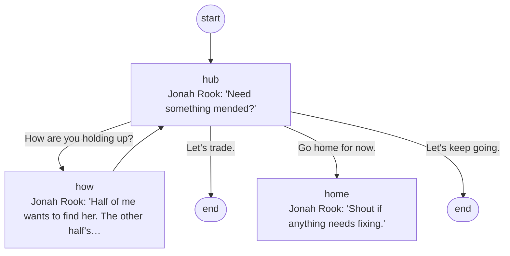
```mermaid
flowchart TD
  camp_jonah_START(("start"))
  camp_jonah_START --> camp_jonah_hub
  camp_jonah_hub["hub<br/>Jonah Rook: 'Need something mended?'"]
  camp_jonah_hub -->|"How are you holding up?"| camp_jonah_how
  camp_jonah_hub_end_1(["end"])
  camp_jonah_hub -->|"Let's trade."| camp_jonah_hub_end_1
  camp_jonah_hub -->|"Go home for now."| camp_jonah_home
  camp_jonah_hub_end_3(["end"])
  camp_jonah_hub -->|"Let's keep going."| camp_jonah_hub_end_3
  camp_jonah_how["how<br/>Jonah Rook: 'Half of me wants to find her. The other half's…"]
  camp_jonah_how --> camp_jonah_hub
  camp_jonah_home["home<br/>Jonah Rook: 'Shout if anything needs fixing.'"]
```

### camp_mara

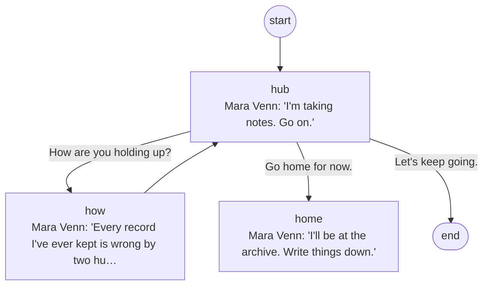
```mermaid
flowchart TD
  camp_mara_START(("start"))
  camp_mara_START --> camp_mara_hub
  camp_mara_hub["hub<br/>Mara Venn: 'I'm taking notes. Go on.'"]
  camp_mara_hub -->|"How are you holding up?"| camp_mara_how
  camp_mara_hub -->|"Go home for now."| camp_mara_home
  camp_mara_hub_end_2(["end"])
  camp_mara_hub -->|"Let's keep going."| camp_mara_hub_end_2
  camp_mara_how["how<br/>Mara Venn: 'Every record I've ever kept is wrong by two hu…"]
  camp_mara_how --> camp_mara_hub
  camp_mara_home["home<br/>Mara Venn: 'I'll be at the archive. Write things down.'"]
```

## lighthouse.json

### hester

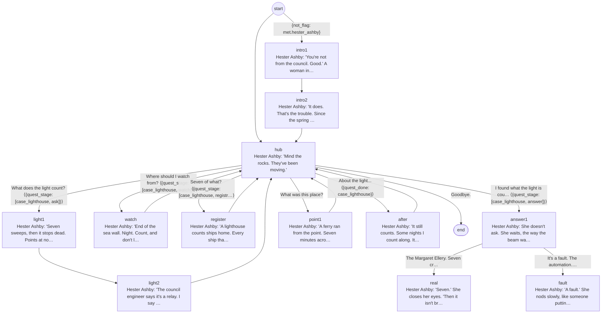
```mermaid
flowchart TD
  hester_START(("start"))
  hester_START --> hester_hub
  hester_START -->|"{not_flag: met.hester_ashby}"| hester_intro1
  hester_intro1["intro1<br/>Hester Ashby: 'You're not from the council. Good.' A woman in…"]
  hester_intro1 --> hester_intro2
  hester_intro2["intro2<br/>Hester Ashby: 'It does. That's the trouble. Since the spring …"]
  hester_intro2 --> hester_hub
  hester_hub["hub<br/>Hester Ashby: 'Mind the rocks. They've been moving.'"]
  hester_hub -->|"What does the light count? ⟨{quest_stage: [case_lighthouse, ask]}⟩"| hester_light1
  hester_hub -->|"Where should I watch from? ⟨{quest_stage: [case_lighthouse, watch]}⟩"| hester_watch
  hester_hub -->|"Seven of what? ⟨{quest_stage: [case_lighthouse, registr…⟩"| hester_register
  hester_hub -->|"I found what the light is cou… ⟨{quest_stage: [case_lighthouse, answer]}⟩"| hester_answer1
  hester_hub -->|"What was this place?"| hester_point1
  hester_hub -->|"About the light... ⟨{quest_done: case_lighthouse}⟩"| hester_after
  hester_hub_end_6(["end"])
  hester_hub -->|"Goodbye."| hester_hub_end_6
  hester_light1["light1<br/>Hester Ashby: 'Seven sweeps, then it stops dead. Points at no…"]
  hester_light1 --> hester_light2
  hester_light2["light2<br/>Hester Ashby: 'The council engineer says it's a relay. I say …"]
  hester_light2 --> hester_hub
  hester_watch["watch<br/>Hester Ashby: 'End of the sea wall. Night. Count, and don't l…"]
  hester_watch --> hester_hub
  hester_register["register<br/>Hester Ashby: 'A lighthouse counts ships home. Every ship tha…"]
  hester_register --> hester_hub
  hester_answer1["answer1<br/>Hester Ashby: She doesn't ask. She waits, the way the beam wa…"]
  hester_answer1 -->|"The Margaret Ellery. Seven cr…"| hester_real
  hester_answer1 -->|"It's a fault. The automation.…"| hester_fault
  hester_real["real<br/>Hester Ashby: 'Seven.' She closes her eyes. 'Then it isn't br…"]
  hester_fault["fault<br/>Hester Ashby: 'A fault.' She nods slowly, like someone puttin…"]
  hester_point1["point1<br/>Hester Ashby: 'A ferry ran from the point. Seven minutes acro…"]
  hester_point1 --> hester_hub
  hester_after["after<br/>Hester Ashby: 'It still counts. Some nights I count along. It…"]
  hester_after --> hester_hub
```

### lighthouse_watch

```mermaid
flowchart TD
  lighthouse_watch_START(("start"))
  lighthouse_watch_START --> lighthouse_watch_idle
  lighthouse_watch_START -->|"{quest_stage: [case_lighthouse, watch],…"| lighthouse_watch_count1
  lighthouse_watch_START -->|"{quest_stage: [case_lighthouse, watch]}"| lighthouse_watch_wait
  lighthouse_watch_START -->|"{flag: world.lamp_counts, period: night}"| lighthouse_watch_after_real
  lighthouse_watch_idle["idle<br/>The end of the sea wall. The lighthouse turns i…"]
  lighthouse_watch_wait["wait<br/>In daylight the lamp is just glass. Hester said…"]
  lighthouse_watch_count1["count1<br/>You count. One sweep, two... seven. Then the be…"]
  lighthouse_watch_count1 --> lighthouse_watch_count2
  lighthouse_watch_count2["count2<br/>Seven again. Out on the water, for the length o…"]
  lighthouse_watch_after_real["after_real<br/>Seven sweeps, a pause. Somewhere out there, sev…"]
```

### lighthouse_door

```mermaid
flowchart TD
  lighthouse_door_START(("start"))
  lighthouse_door_START --> lighthouse_door_1
  lighthouse_door_1["1<br/>The lighthouse door is locked. A council padloc…"]
```

### point_signpost

```mermaid
flowchart TD
  point_signpost_START(("start"))
  point_signpost_START --> point_signpost_1
  point_signpost_1["1<br/>A weathered signpost. One arm says GREYFORD. Th…"]
  point_signpost_1 --> point_signpost_2
  point_signpost_2["2<br/>Underneath, someone has carved: FERRY — 7 MIN."]
```

## people.json

### mara

```mermaid
flowchart TD
  mara_START(("start"))
  mara_START --> mara_hub
  mara_START -->|"{flag: mara.lied, knows: [mara_venn, ag…"| mara_lie_found
  mara_START -->|"{quest_stage: [case_eleventh, start]}"| mara_arch_in1
  mara_START -->|"{quest_stage: [case_eleventh, search]}"| mara_arch_wait
  mara_START -->|"{quest_stage: [case_eleventh, choice]}"| mara_file_ask
  mara_START -->|"{not_flag: met.mara_venn}"| mara_intro1
  mara_START -->|"{knows: [mara_venn, reported_door], not…"| mara_reported
  mara_START -->|"{flag: door.vanished, not_flag: mara.he…"| mara_echo_shared
  mara_START -->|"{flag: door.vanished, not_flag: mara.he…"| mara_echo_secret
  mara_START -->|"{hypothesis: lantern_row_fragment, not_…"| mara_decide
  mara_START -->|"{flag: rel.mara_venn.friend, quest_done…"| mara_eleventh1
  mara_intro1["intro1<br/>Mara Venn: You're the new tenant in the brown house on the…"]
  mara_intro1 --> mara_intro2
  mara_intro2["intro2<br/>Mara Venn: 'Redevelopment.' They say that word the way peo…"]
  mara_intro2 --> mara_intro3
  mara_intro3["intro3<br/>Mara Venn: If you see anything... strange around here, wri…"]
  mara_hub["hub<br/>Mara Venn: Mara looks up from her notebook. 'Yes?'"]
  mara_hub -->|"What was here before the plaz… ⟨{evidence: e_door_observed, not_evidenc…⟩"| mara_plaza1
  mara_hub -->|"Why was the archive closed? ⟨{not_flag: mara.archive_talk}⟩"| mara_archive1
  mara_hub -->|"Show her the 1962 survey plan ⟨{evidence: e_city_map, not_flag: mara.s…⟩"| mara_map1
  mara_hub -->|"About the door — I want to te… ⟨{flag: mara.kept_out, not_flag: door.de…⟩"| mara_tell1
  mara_hub -->|"Give Mara the Census page ⟨{has_item: ledger_page, flag: rosalind.…⟩"| mara_page1
  mara_hub -->|"The same mark is in all three… ⟨{quest_stage: [case_two_maps, map]}⟩"| mara_mark1
  mara_hub -->|"Come with me for a while? ⟨{can_join: mara_venn}⟩"| mara_join
  mara_hub_end_7(["end"])
  mara_hub -->|"Goodbye."| mara_hub_end_7
  mara_plaza1["plaza1<br/>Mara Venn: 'Before the plaza? A car park. Before that—' Sh…"]
  mara_plaza1 --> mara_plaza2
  mara_plaza2["plaza2<br/>Mara Venn: 'The rate books list a street. Lantern Row. Nin…"]
  mara_plaza2 --> mara_plaza3
  mara_plaza3["plaza3<br/>Mara Venn: 'Funny thing. Nobody I ask remembers it. Not ev…"]
  mara_plaza3 --> mara_hub
  mara_archive1["archive1<br/>Mara Venn: 'Officially: asbestos. Unofficially: the week b…"]
  mara_archive1 --> mara_archive2
  mara_archive2["archive2<br/>Mara Venn: 'They sent them back. Lighter.'"]
  mara_archive2 --> mara_hub
  mara_map1["map1<br/>Mara Venn: 'Where did you get this? It's a survey plan — L…"]
  mara_map1 --> mara_hub
  mara_decide["decide<br/>Mara Venn: 'You've got that look. You found out something …"]
  mara_decide -->|"Tell her everything"| mara_tell1
  mara_decide -->|"Keep it to yourself for now"| mara_keep1
  mara_tell1["tell1<br/>Mara Venn: She listens without interrupting. 'A piece of L…"]
  mara_tell1 --> mara_tell2
  mara_tell2["tell2<br/>Mara Venn: 'If you go through, I want to know everything. …"]
  mara_keep1["keep1<br/>Mara Venn: 'Suit yourself.' She doesn't sound offended. Sh…"]
  mara_reported["reported<br/>Mara Venn: 'You called Civic Renewal.' It isn't a question…"]
  mara_echo_shared["echo_shared<br/>Mara Venn: 'Well? Dates, times, exact words.' You tell her…"]
  mara_echo_shared --> mara_echo_shared2
  mara_echo_shared2["echo_shared2<br/>Mara Venn: 'Number eleven,' she says at last, very quietly…"]
  mara_echo_secret["echo_secret<br/>Mara Venn: 'The door's gone. You went through, didn't you.…"]
  mara_page1["page1<br/>Mara Venn: 'A Census Office ledger.' Her hands are perfect…"]
  mara_page1 --> mara_page2
  mara_page2["page2<br/>Mara Venn: 'It's safe with me. It goes in the archive — th…"]
  mara_eleventh1["eleventh1<br/>Mara Venn: 'I need to ask you something that isn't strictl…"]
  mara_eleventh1 --> mara_eleventh2
  mara_eleventh2["eleventh2<br/>Mara Venn: 'My grandmother Agnes was at number eleven, Lan…"]
  mara_eleventh2 --> mara_eleventh3
  mara_eleventh3["eleventh3<br/>Mara Venn: 'The archive's sealed, but I never handed in my…"]
  mara_arch_in1["arch_in1<br/>Mara Venn: 'You came. Good.' She keeps her torch low. 'Cen…"]
  mara_arch_wait["arch_wait<br/>Mara Venn: 'Back wall. Drawer L.' She doesn't look up from…"]
  mara_arch_wait --> mara_hub
  mara_file_ask["file_ask<br/>Mara Venn: 'Well?' Her voice is very even. 'Did you find h…"]
  mara_file_ask -->|"Give her the file"| mara_show1
  mara_file_ask -->|"'Let's read it together — the…"| mara_seal1
  mara_file_ask -->|"'The drawer was empty.'"| mara_lie1
  mara_show1["show1<br/>Mara Venn: She reads. Then reads again. 'Grandma signed th…"]
  mara_show1 --> mara_show2
  mara_show2["show2<br/>Mara Venn: 'I've hidden one page of hers for twelve years.…"]
  mara_seal1["seal1<br/>Mara Venn: You read it together. Afterwards she puts it ba…"]
  mara_lie1["lie1<br/>Mara Venn: 'Empty.' She looks at you for a long time. 'Tha…"]
  mara_lie_found["lie_found<br/>Mara Venn: 'You knew.' She has a newspaper folded in her h…"]
  mara_mark1["mark1<br/>Mara Venn: 'Three lines to a point: it's a surveyor's mark…"]
  mara_mark1 --> mara_hub
  mara_join["join<br/>Mara Venn: 'I'll bring a notebook. Things that aren't writ…"]
```

### jonah

```mermaid
flowchart TD
  jonah_START(("start"))
  jonah_START --> jonah_hub
  jonah_START -->|"{not_flag: met.jonah_rook}"| jonah_intro1
  jonah_START -->|"{quest_stage: [case_radio, deliver]}"| jonah_remind
  jonah_START -->|"{quest_stage: [case_radio, return]}"| jonah_reward1
  jonah_START -->|"{has_item: ledger_page, quest_active: c…"| jonah_page1
  jonah_START -->|"{quest_done: case_door, not_quest_start…"| jonah_sister1
  jonah_START -->|"{quest_stage: [case_bell, parts], has_i…"| jonah_bell_fix
  jonah_START -->|"{remembers: [jonah_rook, told_truth_abo…"| jonah_bell1
  jonah_START -->|"{quest_done: case_bell, not_flag: jonah…"| jonah_bell_after
  jonah_START -->|"{repair_level_at_least: 3, flag: rel.jo…"| jonah_stall1
  jonah_intro1["intro1<br/>Jonah Rook: 'Jonah Rook. I repair things nobody makes any m…"]
  jonah_intro1 --> jonah_intro2
  jonah_intro2["intro2<br/>Jonah Rook: 'You're new? Then you're exactly who I need. I'…"]
  jonah_intro2 --> jonah_offer
  jonah_offer["offer<br/>Jonah Rook: 'Mrs Halloway's radio is fixed. Could you take …"]
  jonah_offer -->|"Sure, I'll take it."| jonah_accept1
  jonah_offer -->|"(Repair technician) Let me ch… ⟨{background: repair_technician}⟩"| jonah_tech1
  jonah_offer -->|"Not right now."| jonah_decline1
  jonah_accept1["accept1<br/>Jonah Rook: 'Lifesaver. Don't let her tip you — she can't a…"]
  jonah_tech1["tech1<br/>You open the back. Someone has soldered the dia…"]
  jonah_tech1 --> jonah_tech2
  jonah_tech2["tech2<br/>Jonah Rook: Jonah frowns. 'I didn't do that.' A pause. 'Lea…"]
  jonah_decline1["decline1<br/>Jonah Rook: 'No worries. I'll be around.'"]
  jonah_remind["remind<br/>Jonah Rook: 'Radio still in one piece? Mrs Halloway's by th…"]
  jonah_remind --> jonah_hub
  jonah_reward1["reward1<br/>Jonah Rook: 'She called me. Said the radio 'talked about La…"]
  jonah_reward1 --> jonah_reward2
  jonah_reward2["reward2<br/>Jonah Rook: 'My sister used to say that name. Before.' He s…"]
  jonah_reward2 --> jonah_reward3
  jonah_reward3["reward3<br/>Jonah Rook: 'Here. This was lining the radio's box — an old…"]
  jonah_hub["hub<br/>Jonah Rook: 'Need something fixed?'"]
  jonah_hub -->|"What's this 'tram inspection'?"| jonah_tram1
  jonah_hub_end_1(["end"])
  jonah_hub -->|"Let's trade."| jonah_hub_end_1
  jonah_hub -->|"Got any work?"| jonah_jobs1
  jonah_hub -->|"Could you spare some scrap to… ⟨{flag: jobs.intro, not_flag: jobs.scrap…⟩"| jonah_jobs_gift
  jonah_hub -->|"About the radio... ⟨{not_quest_started: case_radio}⟩"| jonah_offer
  jonah_hub -->|"About Rosalind... ⟨{quest_active: case_rosalind}⟩"| jonah_sister_remind
  jonah_hub -->|"Remind me what the bell needs? ⟨{quest_stage: [case_bell, parts]}⟩"| jonah_parts_hint
  jonah_hub -->|"Heard about the Margaret Elle… ⟨{knows: [jonah_rook, margaret_ellery]}⟩"| jonah_ship
  jonah_hub -->|"Anything strange happen to yo… ⟨{quest_active: case_two_maps, not_quest…⟩"| jonah_strange1
  jonah_hub -->|"I made it into your storeroom. ⟨{quest_stage: [case_storeroom, tell]}⟩"| jonah_sr1
  jonah_hub -->|"Come with me for a while? ⟨{can_join: jonah_rook}⟩"| jonah_join
  jonah_hub_end_11(["end"])
  jonah_hub -->|"Goodbye."| jonah_hub_end_11
  jonah_tram1["tram1<br/>Jonah Rook: 'The line closed in '89. But when it rains, peo…"]
  jonah_tram1 --> jonah_tram2
  jonah_tram2["tram2<br/>Jonah Rook: 'So I go and check. Every time. Nothing's ever …"]
  jonah_tram2 --> jonah_hub
  jonah_sister1["sister1<br/>Jonah Rook: Jonah watches you for a long moment. 'You've be…"]
  jonah_sister1 --> jonah_sister2
  jonah_sister2["sister2<br/>Jonah Rook: 'I had a sister. Rosalind. Older than me. In '8…"]
  jonah_sister2 --> jonah_sister3
  jonah_sister3["sister3<br/>Jonah Rook: 'When it rains, or after dark, the tram bell ri…"]
  jonah_sister3 --> jonah_sister4
  jonah_sister4["sister4<br/>Jonah Rook: 'And take this. You'll want something better th…"]
  jonah_sister_remind["sister_remind<br/>Jonah Rook: 'Evenings, nights, rain. The stop by the harbou…"]
  jonah_sister_remind --> jonah_hub
  jonah_page1["page1<br/>Jonah sees the paper in your hand before you sa…"]
  jonah_page1 -->|"Show him the page"| jonah_truth1
  jonah_page1 -->|"Tell him you found nothing"| jonah_spare1
  jonah_truth1["truth1<br/>Jonah Rook: He reads it three times. 'Not resident.' A laug…"]
  jonah_truth1 --> jonah_truth2
  jonah_truth2["truth2<br/>Jonah Rook: 'Somebody signed this. Somebody stamped it.' He…"]
  jonah_spare1["spare1<br/>Jonah Rook: He nods slowly. 'Thanks for looking. Really.' H…"]
  jonah_bell1["bell1<br/>Jonah Rook: 'I keep seeing her. Tram windows, puddles. Yest…"]
  jonah_bell1 --> jonah_bell2
  jonah_bell2["bell2<br/>Jonah Rook: 'The old harbour stop had a bell. If it rang ag…"]
  jonah_bell2 --> jonah_bell3
  jonah_bell3["bell3<br/>Jonah Rook: 'I need a clapper, copper flex and a relay. Hel…"]
  jonah_parts_hint["parts_hint<br/>Jonah Rook: 'Clapper from that platform of yours. Copper fl…"]
  jonah_parts_hint --> jonah_hub
  jonah_bell_fix["bell_fix<br/>Jonah Rook: He works through the afternoon without speaking…"]
  jonah_bell_after["bell_after<br/>Jonah Rook: 'I heard it from the shop.' He doesn't ask what…"]
  jonah_jobs1["jobs1<br/>Jonah Rook: 'Plenty. Half of Greyford rattles, the other ha…"]
  jonah_jobs1 --> jonah_jobs2
  jonah_jobs2["jobs2<br/>Jonah Rook: 'You'll need scrap. I sell it, or dig through t…"]
  jonah_jobs2 --> jonah_hub
  jonah_jobs_gift["jobs_gift<br/>Jonah Rook: 'Here. First four are on the house. After that …"]
  jonah_jobs_gift --> jonah_hub
  jonah_stall1["stall1<br/>Jonah Rook: 'You've fixed half the street.' He looks almost…"]
  jonah_stall1 --> jonah_stall2
  jonah_stall2["stall2<br/>Jonah Rook: 'Take it. Sell repair kits on the plaza. Fair p…"]
  jonah_ship["ship<br/>Jonah Rook: 'Grandad crewed trawlers. There was one boat he…"]
  jonah_ship --> jonah_hub
  jonah_strange1["strange1<br/>Jonah Rook: 'Funny you ask. My storeroom's gone. The door's…"]
  jonah_strange1 --> jonah_strange2
  jonah_strange2["strange2<br/>Jonah Rook: 'Thirty years that was Dad's stock room. At nig…"]
  jonah_strange2 --> jonah_hub
  jonah_sr1["sr1<br/>Jonah Rook: You tell him about the crates. ROOK & DAUGHTER.…"]
  jonah_sr1 --> jonah_sr2
  jonah_sr2["sr2<br/>Jonah Rook: 'Dad never had a daughter. Not on paper.' He op…"]
  jonah_sr2 --> jonah_hub
  jonah_join["join<br/>Jonah Rook: 'Shop can mind itself. You can't.' He picks up …"]
```

### halloway

```mermaid
flowchart TD
  halloway_START(("start"))
  halloway_START --> halloway_hub
  halloway_START -->|"{flag: has_radio, quest_stage: [case_ra…"| halloway_radio1
  halloway_START -->|"{not_flag: met.edda_halloway, backgroun…"| halloway_local1
  halloway_START -->|"{not_flag: met.edda_halloway}"| halloway_intro1
  halloway_START -->|"{knows: [edda_halloway, rosalind_erased…"| halloway_rosalind
  halloway_intro1["intro1<br/>Edda Halloway: 'So you're my new lodger. Edda Halloway. Rent o…"]
  halloway_local1["local1<br/>Edda Halloway: 'Well I never — {name}! You were this high when…"]
  halloway_local1 --> halloway_local2
  halloway_local2["local2<br/>Edda Halloway: 'Funny... I can't remember which street you liv…"]
  halloway_radio1["radio1<br/>Edda Halloway: 'My radio! Oh, Jonah's a dear.' She switches it…"]
  halloway_radio1 --> halloway_radio2
  halloway_radio2["radio2<br/>Static, then a calm voice: '...next stop, Lante…"]
  halloway_radio2 --> halloway_radio3
  halloway_radio3["radio3<br/>Mrs Halloway turns it off very quickly."]
  halloway_radio3 --> halloway_radio4
  halloway_radio4["radio4<br/>Edda Halloway: 'Lantern Row was before the redevelopment. Befo…"]
  halloway_hub["hub<br/>Edda Halloway: 'Settling in, dear?'"]
  halloway_hub -->|"About your note — the tram at… ⟨{evidence: e_landlord_note, not_flag: h…⟩"| halloway_note1
  halloway_hub -->|"Did you know a street called … ⟨{evidence: e_door_observed, not_evidenc…⟩"| halloway_lr1
  halloway_hub -->|"Do you have any copper wire? ⟨{quest_stage: [case_bell, parts], all: …⟩"| halloway_wire1
  halloway_hub -->|"There's a letter for you ⟨{has_item: letter_halloway}⟩"| halloway_letter1
  halloway_hub_end_4(["end"])
  halloway_hub -->|"About my room..."| halloway_hub_end_4
  halloway_hub -->|"Mrs Halloway, I need to show … ⟨{quest_stage: [case_two_maps, turn]}⟩"| halloway_map1
  halloway_hub -->|"Mrs Halloway... does the name… ⟨{flag: ward.bea_message, not_flag: hall…⟩"| halloway_bea1
  halloway_hub_end_7(["end"])
  halloway_hub -->|"Goodbye."| halloway_hub_end_7
  halloway_note1["note1<br/>Edda Halloway: 'Oh, that. Old houses make noises. That's all i…"]
  halloway_note1 --> halloway_hub
  halloway_lr1["lr1<br/>Edda Halloway: 'Lantern Row.' She says it like a word in anoth…"]
  halloway_wire1["wire1<br/>Edda Halloway: 'Harold's old radio flex. He'd have liked it to…"]
  halloway_wire1 --> halloway_hub
  halloway_letter1["letter1<br/>Edda Halloway: She reads it standing up. 'It's from Bea. My si…"]
  halloway_letter1 --> halloway_letter2
  halloway_letter2["letter2<br/>Edda Halloway: 'She says she's happy. That I mustn't come look…"]
  halloway_rosalind["rosalind<br/>Edda Halloway: 'Jonah told me about his sister. About the page…"]
  halloway_map1["map1<br/>Edda Halloway: She unfolds the map and smiles at the ink stree…"]
  halloway_map1 --> halloway_map2
  halloway_map2["map2<br/>Edda Halloway: 'That's my hand. That's how I make my sevens.' …"]
  halloway_map2 --> halloway_map3
  halloway_map3["map3<br/>Edda Halloway: 'Some mornings my pencils are blunt and I can't…"]
  halloway_map3 -->|"Nothing. This stays between u…"| halloway_kept
  halloway_map3 -->|"Mara should see it. She keeps…"| halloway_shared
  halloway_map3 -->|"Who else comes into your flat?"| halloway_who
  halloway_kept["kept<br/>Edda Halloway: 'Thank you, dear.' She puts the map inside her …"]
  halloway_shared["shared<br/>Edda Halloway: 'If you think it's right.' She hands it over an…"]
  halloway_who["who<br/>Edda Halloway: 'Nobody. Well — Mr Calder, for tea, on Sundays.…"]
  halloway_bea1["bea1<br/>Edda Halloway: She is buttering toast. She stops. 'Thursdays,'…"]
  halloway_bea1 --> halloway_bea2
  halloway_bea2["bea2<br/>Edda Halloway: 'I'll leave the back door on the latch on Thurs…"]
  halloway_bea2 --> halloway_hub
```

### ivo

```mermaid
flowchart TD
  ivo_START(("start"))
  ivo_START --> ivo_hub
  ivo_START -->|"{not_flag: met.ivo_calder}"| ivo_intro1
  ivo_START -->|"{knows: [ivo_calder, reported_door], no…"| ivo_reported
  ivo_START -->|"{knows: [ivo_calder, opened_door], not_…"| ivo_echo
  ivo_START -->|"{flag: world.records_published, not_fla…"| ivo_records
  ivo_intro1["intro1<br/>Ivo Calder: 'Ivo Calder. Residents' association — bins, ben…"]
  ivo_intro1 --> ivo_intro2
  ivo_intro2["intro2<br/>Ivo Calder: 'A word of advice, freely given: Greyford is ki…"]
  ivo_hub["hub<br/>Ivo Calder: Ivo nods. 'Evening, neighbour.'"]
  ivo_hub -->|"Have you seen the door on the… ⟨{evidence: e_door_observed, not_evidenc…⟩"| ivo_door1
  ivo_hub -->|"Someone draws three lines und… ⟨{hypothesis: greyford_keeps_quiet, not_…⟩"| ivo_sym1
  ivo_hub -->|"Nadiya asked me to give you t… ⟨{has_item: letter_ivo}⟩"| ivo_letter1
  ivo_hub -->|"What is the Ward? ⟨{quest_stage: [case_misplaced, ward], n…⟩"| ivo_ward1
  ivo_hub_end_4(["end"])
  ivo_hub -->|"Goodbye."| ivo_hub_end_4
  ivo_door1["door1<br/>Ivo Calder: He is quiet for a while. 'Doors like that close…"]
  ivo_door1 --> ivo_door2
  ivo_door2["door2<br/>Ivo Calder: 'Whatever's on the other side has waited a long…"]
  ivo_door2 --> ivo_hub
  ivo_sym1["sym1<br/>Ivo Calder: 'Kids.' A pause. 'Or people who'd rather the re…"]
  ivo_sym1 --> ivo_hub
  ivo_reported["reported<br/>Ivo Calder: 'Civic Renewal fenced off the plaza. Sensible.'…"]
  ivo_echo["echo<br/>Ivo Calder: 'The door's gone.' His voice is flat. 'You open…"]
  ivo_letter1["letter1<br/>Ivo Calder: He doesn't open it. 'I know the handwriting.' H…"]
  ivo_letter1 -->|"'Who are they, Ivo?'"| ivo_letter2
  ivo_letter1_end_1(["end"])
  ivo_letter1 -->|"Leave it there"| ivo_letter1_end_1
  ivo_letter2["letter2<br/>Ivo Calder: A long silence. 'I write to them too. Every win…"]
  ivo_records["records<br/>Ivo Calder: 'The archive files are in the papers.' He looks…"]
  ivo_ward1["ward1<br/>Ivo Calder: Ivo is quiet for long enough that a tram would …"]
  ivo_ward1 --> ivo_ward2
  ivo_ward2["ward2<br/>Ivo Calder: He looks at the harbour for a long time. 'The t…"]
  ivo_ward2 -->|"Take me there. ⟨{not_flag: act1.ivo_tends_halloway}⟩"| ivo_ward_ok
  ivo_ward2 -->|"Like you tidy Mrs Halloway's … ⟨{flag: act1.ivo_tends_halloway}⟩"| ivo_ward_no
  ivo_ward_ok["ward_ok<br/>Ivo Calder: 'Harbour stop, after dark. I'll be there. Come …"]
  ivo_ward_ok --> ivo_hub
  ivo_ward_no["ward_no<br/>Ivo Calder: Something closes in his face. 'Not with you ask…"]
  ivo_ward_no --> ivo_hub
```

### nadiya

```mermaid
flowchart TD
  nadiya_START(("start"))
  nadiya_START --> nadiya_hub
  nadiya_START -->|"{not_flag: met.nadiya_sol}"| nadiya_intro1
  nadiya_START -->|"{knows: [nadiya_sol, reported_door], no…"| nadiya_reported
  nadiya_START -->|"{flag: door.vanished, not_flag: nadiya.…"| nadiya_echo
  nadiya_START -->|"{quest_stage: [case_letters, deliver], …"| nadiya_letters_back
  nadiya_START -->|"{quest_stage: [case_letters, report]}"| nadiya_report1
  nadiya_START -->|"{flag: met.nadiya_sol, quest_done: case…"| nadiya_letters1
  nadiya_intro1["intro1<br/>Nadiya Sol: 'Nadiya. Courier — parcels, letters, the occasi…"]
  nadiya_intro1 --> nadiya_intro2
  nadiya_intro2["intro2<br/>Nadiya Sol: 'You've got that new-in-town look. Everyone her…"]
  nadiya_hub["hub<br/>Nadiya Sol: 'Delivering or receiving?'"]
  nadiya_hub -->|"The door on the plaza... ⟨{evidence: e_door_observed, not_flag: n…⟩"| nadiya_door1
  nadiya_hub -->|"What do you deliver at night?"| nadiya_work1
  nadiya_hub -->|"Do you know a way into the Wa… ⟨{quest_stage: [case_misplaced, ward], n…⟩"| nadiya_ward_nad
  nadiya_hub_end_3(["end"])
  nadiya_hub -->|"Goodbye."| nadiya_hub_end_3
  nadiya_door1["door1<br/>Nadiya Sol: 'You see it too? Good. Most people's eyes just …"]
  nadiya_door1 --> nadiya_door2
  nadiya_door2["door2<br/>Nadiya Sol: 'They tore down a whole street and told everyon…"]
  nadiya_door2 --> nadiya_hub
  nadiya_work1["work1<br/>Nadiya Sol: 'Letters addressed to people who don't exist. T…"]
  nadiya_work1 --> nadiya_hub
  nadiya_reported["reported<br/>Nadiya Sol: 'You handed it to Civic Renewal. Wow. Hope the …"]
  nadiya_echo["echo<br/>Nadiya Sol: 'You went through.' For once she isn't joking. …"]
  nadiya_letters1["letters1<br/>Nadiya Sol: 'I've got three letters I can't deliver. Addres…"]
  nadiya_letters1 --> nadiya_letters2
  nadiya_letters2["letters2<br/>Nadiya Sol: 'One for Mrs Halloway. One for Lantern Row — th…"]
  nadiya_letters_back["letters_back<br/>Nadiya Sol: 'All three? You're good at this.' She grins, th…"]
  nadiya_letters_back --> nadiya_report1
  nadiya_report1["report1<br/>Nadiya Sol: 'Any replies?'"]
  nadiya_report1 -->|"Show her the reply from No. 7 ⟨{has_item: letter_reply}⟩"| nadiya_reply1
  nadiya_report1 -->|"'Not yet.' ⟨{not: {has_item: letter_reply}}⟩"| nadiya_noreply
  nadiya_noreply["noreply<br/>Nadiya Sol: 'Check your post. The Row writes back slowly — …"]
  nadiya_reply1["reply1<br/>Nadiya Sol: She reads it twice. ''We are not lost. Please s…"]
  nadiya_reply1 --> nadiya_reply2
  nadiya_reply2["reply2<br/>Nadiya Sol: 'Some of them don't want to come back.' A long …"]
  nadiya_reply2 -->|"'Then we listen to them.'"| nadiya_respect1
  nadiya_reply2 -->|"'One letter isn't all of them…"| nadiya_persist1
  nadiya_respect1["respect1<br/>Nadiya Sol: 'Restoration without consent is just another ce…"]
  nadiya_persist1["persist1<br/>Nadiya Sol: 'Right. Seven isn't nineteen.' She sounds sure.…"]
  nadiya_ward_nad["ward_nad<br/>Nadiya Sol: 'Course I do. I deliver there.' She taps her ba…"]
  nadiya_ward_nad --> nadiya_hub
```

### pike

```mermaid
flowchart TD
  pike_START(("start"))
  pike_START --> pike_hub
  pike_START -->|"{not_flag: met.dana_pike}"| pike_intro1
  pike_intro1["intro1<br/>Warden Dana Pike: 'Dana Pike, Civic Renewal Office. I keep an eye…"]
  pike_intro1 --> pike_intro2
  pike_intro2["intro2<br/>Warden Dana Pike: 'If you notice anything structurally... unusual…"]
  pike_intro2 --> pike_hub
  pike_hub["hub<br/>Warden Dana Pike: 'Citizen.'"]
  pike_hub -->|"Report the door on the plaza ⟨{evidence: e_door_observed, not_flag: d…⟩"| pike_confirm
  pike_hub -->|"Why is the archive closed?"| pike_archive1
  pike_hub -->|"Could Civic Renewal spare an … ⟨{quest_stage: [case_bell, parts], not: …⟩"| pike_relay
  pike_hub -->|"Hand Agnes Venn's file to Civ… ⟨{has_item: agnes_file}⟩"| pike_file1
  pike_hub -->|"Has the council heard about t… ⟨{flag: ward.open, not_flag: pike.ward_t…⟩"| pike_ward_pike
  pike_hub_end_5(["end"])
  pike_hub -->|"Goodbye."| pike_hub_end_5
  pike_confirm["confirm<br/>If you report it, Civic Renewal will take the d…"]
  pike_confirm -->|"Report it"| pike_report1
  pike_confirm -->|"Never mind"| pike_hub
  pike_report1["report1<br/>Warden Dana Pike: She follows your gaze and her jaw tightens. She…"]
  pike_report1 --> pike_report2
  pike_report2["report2<br/>Warden Dana Pike: 'Thank you. We'll take it from here. Please don…"]
  pike_archive1["archive1<br/>Warden Dana Pike: 'Asbestos survey. Standard procedure.' It sound…"]
  pike_archive1 --> pike_hub
  pike_relay["relay<br/>Warden Dana Pike: 'A relay. For the harbour stop.' She studies yo…"]
  pike_relay -->|"'You helped us before.' ⟨{faction_at_least: [civic, 1]}⟩"| pike_relay_yes
  pike_relay -->|"'Never mind.'"| pike_relay_no
  pike_relay_yes["relay_yes<br/>Warden Dana Pike: 'Off the record.' She unlocks a crate behind th…"]
  pike_relay_yes --> pike_hub
  pike_relay_no["relay_no<br/>Warden Dana Pike: 'Requisition form 14-C. Six to eight weeks.' Sh…"]
  pike_relay_no --> pike_hub
  pike_file1["file1<br/>Warden Dana Pike: She reads the name and goes very still. 'Where …"]
  pike_ward_pike["ward_pike<br/>Warden Dana Pike: Pike's pen stops. 'The council has heard about …"]
  pike_ward_pike -->|"It's real. I'll show you on a…"| pike_ward_rep
  pike_ward_pike -->|"I haven't seen anything."| pike_ward_deny
  pike_ward_rep["ward_rep<br/>Warden Dana Pike: 'Thank you. It will be handled properly.' She m…"]
  pike_ward_rep --> pike_hub
  pike_ward_deny["ward_deny<br/>Warden Dana Pike: 'Of course.' She writes that down too."]
  pike_ward_deny --> pike_hub
```

### echo_woman

```mermaid
flowchart TD
  echo_woman_START(("start"))
  echo_woman_START --> echo_woman_1
  echo_woman_START -->|"{evidence: e_echo_resident}"| echo_woman_after
  echo_woman_1["1<br/>A woman in a green cardigan sits at a kitchen t…"]
  echo_woman_1 --> echo_woman_2
  echo_woman_2["2<br/>Woman in green: '{name}. You came back. You always come back — …"]
  echo_woman_2 --> echo_woman_3
  echo_woman_3["3<br/>Woman in green: 'This is number eleven, Lantern Row. Or it was,…"]
  echo_woman_3 -->|"Who are you?"| echo_woman_who
  echo_woman_3 -->|"How do you know my name?"| echo_woman_name
  echo_woman_who["who<br/>Woman in green: 'Someone who was erased politely. With paperwor…"]
  echo_woman_who --> echo_woman_end
  echo_woman_name["name<br/>Woman in green: 'You lived three doors down. Before.' The tea i…"]
  echo_woman_name --> echo_woman_end
  echo_woman_end["end<br/>Woman in green: 'Go back now. The door won't hold much longer —…"]
  echo_woman_after["after<br/>Woman in green: She is already looking at something you can't s…"]
```

## world.json

### intro

```mermaid
flowchart TD
  intro_START(("start"))
  intro_START --> intro_1
  intro_1["1<br/>The bus pulls away. Greyford smells of salt, we…"]
  intro_1 --> intro_2
  intro_2["2<br/>Your new address is on a slip of paper: the bro…"]
  intro_2 --> intro_3
  intro_3["3<br/>(Tab opens your journal. Look closely, talk to …"]
```

### rest

```mermaid
flowchart TD
  rest_START(("start"))
  rest_START --> rest_ask
  rest_ask["ask<br/>The bed creaks. What now?"]
  rest_ask -->|"Rest a moment (save)"| rest_saved
  rest_ask -->|"Wait until evening (save) ⟨{period: [morning, afternoon]}⟩"| rest_waited
  rest_ask -->|"Sleep until morning (save) ⟨{period: [evening, night]}⟩"| rest_slept
  rest_ask_end_3(["end"])
  rest_ask -->|"Not now"| rest_ask_end_3
  rest_saved["saved<br/>You sit on the edge of the bed for a while. The…"]
  rest_waited["waited<br/>You doze off to the radiator's knocking. When y…"]
  rest_slept["slept<br/>You sleep badly. In the dream, a tram bell ring…"]
```

### woke_up

```mermaid
flowchart TD
  woke_up_START(("start"))
  woke_up_START --> woke_up_1
  woke_up_1["1<br/>You wake on your own bed, coat still on. Your k…"]
  woke_up_1 --> woke_up_2
  woke_up_2["2<br/>Whatever was in that corridor, it is still ther…"]
```

### landlord_note

```mermaid
flowchart TD
  landlord_note_START(("start"))
  landlord_note_START --> landlord_note_1
  landlord_note_START -->|"{evidence: e_landlord_note}"| landlord_note_again
  landlord_note_1["1<br/>A note from the landlord: 'Welcome to Greyford!…"]
  landlord_note_1 --> landlord_note_2
  landlord_note_2["2<br/>'If you hear the tram at night: there isn't one…"]
  landlord_note_2 --> landlord_note_3
  landlord_note_3["3<br/>'Please don't ask the neighbours about it.' The…"]
  landlord_note_again["again<br/>'...don't ask the neighbours about it.'"]
```

### rook_shop

```mermaid
flowchart TD
  rook_shop_START(("start"))
  rook_shop_START --> rook_shop_1
  rook_shop_START -->|"{evidence: e_rook_note}"| rook_shop_again
  rook_shop_1["1<br/>ROOK REPAIRS & HARDWARE. Closed."]
  rook_shop_1 --> rook_shop_2
  rook_shop_2["2<br/>A note is taped to the glass: 'Back after the t…"]
  rook_shop_again["again<br/>'Back after the tram inspection. — J.'"]
```

### yellow_condo

```mermaid
flowchart TD
  yellow_condo_START(("start"))
  yellow_condo_START --> yellow_condo_1
  yellow_condo_START -->|"{evidence: e_symbol}"| yellow_condo_again
  yellow_condo_1["1<br/>Fresh paint over old paint. Under the doorbell,…"]
  yellow_condo_1 --> yellow_condo_2
  yellow_condo_2["2<br/>Three lines meeting at a point. The same mark i…"]
  yellow_condo_again["again<br/>The three-line mark. Someone repainted around i…"]
```

### veil_door

```mermaid
flowchart TD
  veil_door_START(("start"))
  veil_door_START --> veil_door_repeat1
  veil_door_START -->|"{not_evidence: e_door_observed}"| veil_door_first1
  veil_door_START -->|"{hypothesis: lantern_row_fragment}"| veil_door_ready
  veil_door_first1["first1<br/>A doorway stands alone in the middle of the pla…"]
  veil_door_first1 --> veil_door_first2
  veil_door_first2["first2<br/>Through the little window: a corridor with gree…"]
  veil_door_first2 --> veil_door_first3
  veil_door_first3["first3<br/>Someone on the other side says a name. Yours. A…"]
  veil_door_first3 --> veil_door_first4
  veil_door_first4["first4<br/>You blink — and for a moment the plaza remember…"]
  veil_door_repeat1["repeat1<br/>The door is still here. Nobody else on the plaz…"]
  veil_door_repeat1 --> veil_door_repeat2
  veil_door_repeat2["repeat2<br/>The handle is warm. You don't understand enough…"]
  veil_door_ready["ready<br/>Behind the little window, the corridor waits. G…"]
  veil_door_ready_end_0(["end"])
  veil_door_ready -->|"Open the door"| veil_door_ready_end_0
  veil_door_ready_end_1(["end"])
  veil_door_ready -->|"Not yet"| veil_door_ready_end_1
```

### door_gone

```mermaid
flowchart TD
  door_gone_START(("start"))
  door_gone_START --> door_gone_1
  door_gone_1["1<br/>Where the door stood, the paving stones are dry…"]
```

### barriers

```mermaid
flowchart TD
  barriers_START(("start"))
  barriers_START --> barriers_1
  barriers_1["1<br/>Orange barriers and a laminated notice: CIVIC R…"]
```

### echo_photo

```mermaid
flowchart TD
  echo_photo_START(("start"))
  echo_photo_START --> echo_photo_1
  echo_photo_START -->|"{evidence: e_echo_photo}"| echo_photo_again
  echo_photo_1["1<br/>A framed photo of a street party under paper la…"]
  echo_photo_1 --> echo_photo_2
  echo_photo_2["2<br/>— except one child at the edge, who looks exact…"]
  echo_photo_again["again<br/>The child in the photo is still looking at you."]
```

### echo_entrance

```mermaid
flowchart TD
  echo_entrance_START(("start"))
  echo_entrance_START --> echo_entrance_1
  echo_entrance_1["1<br/>The door closes behind you without a sound. The…"]
  echo_entrance_1 --> echo_entrance_2
  echo_entrance_2["2<br/>Pale shapes drift along the corridor, repeating…"]
```

### ghost_tram

```mermaid
flowchart TD
  ghost_tram_START(("start"))
  ghost_tram_START --> ghost_tram_1
  ghost_tram_START -->|"{evidence: e_tram_stop}"| ghost_tram_again
  ghost_tram_1["1<br/>A bell rings out over the water. A tram that is…"]
  ghost_tram_1 --> ghost_tram_2
  ghost_tram_2["2<br/>The sign reads LANTERN ROW. Under it, someone h…"]
  ghost_tram_2 --> ghost_tram_ask
  ghost_tram_again["again<br/>The bell rings. The doors are open. Nobody else…"]
  ghost_tram_again --> ghost_tram_ask
  ghost_tram_ask["ask<br/>The doors are waiting."]
  ghost_tram_ask_end_0(["end"])
  ghost_tram_ask -->|"Board the tram"| ghost_tram_ask_end_0
  ghost_tram_ask_end_1(["end"])
  ghost_tram_ask -->|"Stay on the promenade"| ghost_tram_ask_end_1
```

### platform_enter

```mermaid
flowchart TD
  platform_enter_START(("start"))
  platform_enter_START --> platform_enter_1
  platform_enter_1["1<br/>The doors fold open onto a platform lit by lamp…"]
  platform_enter_1 --> platform_enter_2
  platform_enter_2["2<br/>Somewhere ahead, a pen scratches. Someone is st…"]
  platform_enter_2 --> platform_enter_3
  platform_enter_3["3<br/>(Space / K — dodge. Q — Lantern Flash stuns ech…"]
```

### platform_map

```mermaid
flowchart TD
  platform_map_START(("start"))
  platform_map_START --> platform_map_1
  platform_map_1["1<br/>A route map. Every stop has a name you know — e…"]
  platform_map_1 --> platform_map_2
  platform_map_2["2<br/>Someone has written in the margin, in careful c…"]
```

### archive_door_locked

```mermaid
flowchart TD
  archive_door_locked_START(("start"))
  archive_door_locked_START --> archive_door_locked_1
  archive_door_locked_1["1<br/>Boarded, chained, sealed with a Civic Renewal n…"]
```

### census_cabinet

```mermaid
flowchart TD
  census_cabinet_START(("start"))
  census_cabinet_START --> census_cabinet_idle
  census_cabinet_START -->|"{quest_stage: [case_eleventh, search]}"| census_cabinet_1
  census_cabinet_START -->|"{evidence: e_agnes_file}"| census_cabinet_after
  census_cabinet_idle["idle<br/>A grey cabinet labelled CENSUS 1960–1975. Locke…"]
  census_cabinet_1["1<br/>Drawer L. Folders for nineteen houses on Lanter…"]
  census_cabinet_1 --> census_cabinet_2
  census_cabinet_2["2<br/>'Venn, Agnes. Census enumerator.' Below it, pag…"]
  census_cabinet_after["after<br/>Drawer L, emptier than before."]
```

### archive_shelves

```mermaid
flowchart TD
  archive_shelves_START(("start"))
  archive_shelves_START --> archive_shelves_1
  archive_shelves_START -->|"{quest_stage: [case_lighthouse, registr…"| archive_shelves_register1
  archive_shelves_1["1<br/>Redevelopment files, 1960–1975. Every folder is…"]
  archive_shelves_register1["register1<br/>On the bottom shelf: harbour registers, one fat…"]
  archive_shelves_register1 --> archive_shelves_register2
  archive_shelves_register2["register2<br/>The index at the back still remembers: MARGARET…"]
```

### sos_box

```mermaid
flowchart TD
  sos_box_START(("start"))
  sos_box_START --> sos_box_idle
  sos_box_START -->|"{has_item: letter_lantern}"| sos_box_post
  sos_box_idle["idle<br/>An emergency box. Inside, a slot marked POST."]
  sos_box_post["post<br/>You post Nadiya's letter. A dry, papery sound, …"]
```

### old_bell

```mermaid
flowchart TD
  old_bell_START(("start"))
  old_bell_START --> old_bell_idle
  old_bell_START -->|"{quest_stage: [case_bell, ring], period…"| old_bell_ring1
  old_bell_START -->|"{quest_stage: [case_bell, ring]}"| old_bell_wait
  old_bell_idle["idle<br/>The old harbour tram stop. Somebody has polishe…"]
  old_bell_wait["wait<br/>The bell is ready. Jonah said she comes at nigh…"]
  old_bell_ring1["ring1<br/>The bell's note goes out over the water and doe…"]
  old_bell_ring1 --> old_bell_ring2
  old_bell_ring2["ring2<br/>In the black water, a girl in a school coat loo…"]
  old_bell_ring2 --> old_bell_ring3
  old_bell_ring3["ring3<br/>She is waiting for an answer."]
  old_bell_ring3 -->|"'Yes. Every day.'"| old_bell_waiting
  old_bell_ring3 -->|"'Go home, Rosalind.'"| old_bell_home
  old_bell_waiting["waiting<br/>She smiles like someone who's been told the rig…"]
  old_bell_home["home<br/>'Which one?' she asks — and is gone before you …"]
```

### records_flyer

```mermaid
flowchart TD
  records_flyer_START(("start"))
  records_flyer_START --> records_flyer_1
  records_flyer_1["1<br/>A photocopied flyer: OPEN THE RECORDS. 19 HOUSE…"]
```

### missing_poster

```mermaid
flowchart TD
  missing_poster_START(("start"))
  missing_poster_START --> missing_poster_1
  missing_poster_1["1<br/>MISSING SINCE 1989: ROSALIND ROOK. Somebody has…"]
```

